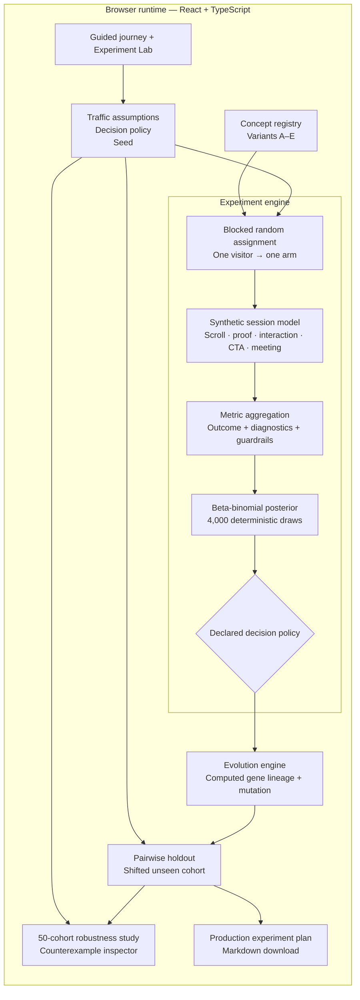

# Project EVOLVE

An inspectable landing-page evolution system built for the Scholé Growth Engineer challenge.

EVOLVE compares five strategically different landing pages, simulates visitor sessions with explicit assumptions, selects an incumbent using a Bayesian evidence policy, generates a challenger with visible lineage, and tests that challenger against an unseen holdout cohort.

## Challenge coverage

| Requirement from the brief | Where EVOLVE satisfies it |
| --- | --- |
| Develop and host a web app | Production Vercel deployment |
| Compare at least five landing pages | Generation 0 contains five complete Scholé concepts |
| Vary messaging, structure, layout, or CTA | Every concept has a distinct promise, sequence, interaction, and CTA |
| Simulate user behavior | Seeded sessions model clicks, scroll depth, dwell, proof engagement, interactions, and demo completion |
| Explain how pages were compared | Concept hypotheses, exposed simulation assumptions, and Bayesian policy |
| Identify better-performing versions | Results view selects an incumbent only after the declared volume, probability, and practical-lift policy |
| Generate a new variation | Generation 1 creates Variant F from inherited page genes plus one mutation |
| Explain what changed and why | Every generated gene shows its source, evidence, and confidence |
| Learn over time | Discovery → generation → unseen holdout → real-test export |
| Go beyond the requirements | Same-buyer replay, no-decision state, counterfactual lab, 50-cohort robustness study, holdout gauntlet, and production experiment plan |

## The product decision

The demo uses Scholé itself as the product.

- **Buyer:** HR, L&D, and AI transformation leaders
- **Target organization:** 200–2,000 employees with AI tools already deployed
- **Core problem:** access to AI tools has not become effective daily adoption
- **Primary outcome:** qualified meeting completions per eligible, exposed, randomized unique visitor

Clicks, scroll depth, dwell time, and interaction completion are diagnostic signals. They help explain performance; they do not select the winner.

## The five initial concepts

| Variant | Concept | Strategic hypothesis |
| --- | --- | --- |
| A | Adaptive learning | Product-led positioning converts category-aware buyers |
| B | Measurable ROI | Naming the cost of unused AI tools creates buyer urgency |
| C | Role relevance | Role-specific previews make deployment feel concrete |
| D | Research trust | Scientific and enterprise proof reduces perceived risk |
| E | Adoption diagnostic | A self-assessment turns latent concern into an owned problem |

This first round is deliberately called a **concept tournament**. Because messaging, structure, interaction, and CTA vary together, it discovers promising territory but cannot isolate the causal effect of one element.

## Synthetic visitor model

The engine creates one shared population of unique synthetic visitors, then
block-randomizes each visitor to exactly one treatment arm. Each visitor
receives:

- a buyer or non-buyer persona;
- organization fit and purchase intent;
- an ROI, relevance, or research-trust priority;
- an attention profile;
- desktop or mobile context.

These traits influence bounce, scroll depth, proof engagement, interaction completion, CTA clicks, and demo completion through an inspectable probabilistic model.

The same seed reproduces the same assignment and outcome stream. The Experiment
Lab exposes the highest-leverage traffic assumptions, the complete decision
contract, and a low-evidence preset that correctly returns **No winner yet**.

A qualified outcome requires both a completed meeting request and target fit: a
decision-maker persona with organization fit of at least 0.5. Raw CTA clicks and
unqualified requests cannot select a winner.

Synthetic results validate the system mechanics, not Scholé’s real-market conversion lift.

## Evidence policy

A concept is selected only when it has:

- at least 95% posterior probability of delivering an absolute lift of 0.50
  percentage points over the declared baseline;
- at least 80% probability of being the best concept during multi-arm
  discovery;
- at least 20 qualified meetings in every arm;
- valid blocked allocation with every unique visitor assigned once.

Otherwise, the decision is **No winner yet**.

The baseline and every threshold are part of the experiment design object, not
special-cased variant logic. In the pairwise holdout, the challenger can win,
the incumbent can be retained, or the system can return no decision using the
same practical-lift rule in both directions.

The default cohort selects Variant B, Measurable ROI, as the incumbent. The
result table also exposes lead qualification, unqualified-request share, and
mobile/desktop outcome rates as diagnostics so a headline conversion lift
cannot hide a quality or device problem.

## Evolution engine

The generator derives each source from the current experiment:

- the primary promise and structure come from the policy-qualified winner, or
  the observed leader when the result is no decision;
- the interaction comes from the concept with the strongest interaction
  completion;
- proof comes from the concept with the strongest proof engagement;
- every source explanation includes its observed rate.

It introduces one deliberate exploratory mutation: **Get my 20-minute adoption plan**.

Every inherited gene shows its source, evidence, and confidence. The generated
concept also carries that source profile into the holdout simulator; changing
the selected genes changes its modeled response. The generated page remains a
hypothesis—not a proven optimum.

## Holdout gauntlet

The challenger is evaluated on a separate seed and shifted traffic mix:

- more decision-makers;
- greater research scrutiny;
- heavier mobile traffic.

No gene was selected using the holdout. Only after the challenger clears the
symmetric incumbent-versus-challenger policy does EVOLVE generate a production
experiment plan for real randomized traffic.

## Robustness observatory

A single seed can accidentally flatter a model. The Experiment Lab can therefore repeat discovery and holdout across 50 independent deterministic cohorts—840,000 synthetic sessions under the baseline assumptions.

Under the default assumptions, Variant B is selected in 49 of 50 discovery
cohorts. The dynamically composed challenger clears 6 of 50 unseen holdouts,
the incumbent is retained once, and 43 correctly return no decision. That is
the point of the gauntlet: the system does not manufacture “optimization” when
the inherited evidence fails to establish a worthwhile lift. The observatory
exposes those counterexample seeds and lets an operator load the exact cohort
into the Lab instead of hiding exceptions.

Changing any traffic or decision-policy input marks an existing robustness
study stale, and the next run carries the new policy through all 50 cohorts.

Repeated synthetic cohorts test whether the simulation mechanics are stable. They still do not establish real-market lift.

## Run locally

Requirements: Node.js 20+ and pnpm.

```bash
pnpm install
pnpm dev
```

Open `http://127.0.0.1:4173`.

## Verify

```bash
pnpm test
pnpm build
```

## Technical architecture

EVOLVE is a client-side analytical application. The browser owns the complete
experiment lifecycle: configuration, randomization, synthetic behavior,
inference, challenger generation, holdout evaluation, and export. There is no
backend and no hidden result payload.



### Experiment lifecycle

1. **Declare the design.** `SimulatorConfig` defines the seed, traffic mix, and
   sample size. `DecisionPolicy` defines the minimum practical lift,
   probability requirements, and minimum outcome volume. The design names its
   baseline explicitly.
2. **Create one randomized population.** The engine creates
   `variants × sessionsPerVariant` unique visitors, shuffles an exactly balanced
   assignment vector, and assigns every visitor to one arm only.
3. **Separate sources of randomness.** Assignment, visitor traits, behavioral
   outcomes, and posterior sampling use deterministic seeded streams. The same
   inputs reproduce the same experiment without coupling treatment assignment
   to visitor generation.
4. **Simulate the journey.** Persona, organization fit, intent, attention, pain
   priority, device, and page-gene profile influence bounce, scroll, proof,
   interaction, CTA, and meeting completion through inspectable probability
   functions.
5. **Aggregate the metric hierarchy.** The primary metric is qualified meetings
   per randomized visitor. CTA rate, interaction, scroll, and dwell explain the
   funnel. Qualification, unqualified-request share, device rates, and
   allocation integrity expose possible regressions.
6. **Estimate uncertainty.** For each arm, the engine samples 4,000 draws from a
   `Beta(qualified + 1, visitors - qualified + 1)` posterior. Those draws
   produce credible intervals, probability of being best, and probability of
   clearing the practical-lift threshold.
7. **Apply the decision contract.** Discovery can select an alternative, retain
   the declared baseline, or return no decision. The pairwise holdout applies
   the same minimum-lift rule in both directions.
8. **Generate from evidence.** The evolution engine derives the promise and
   structure from the outcome leader, the interaction and proof genes from
   their strongest behavior signals, and one explicit exploratory mutation.
   The resulting `modelProfile` controls how the challenger behaves in the
   holdout; Variant F is not a fixed result card.
9. **Test generalization.** The holdout changes the seed and traffic mix only
   after generation. The robustness study repeats the entire discovery →
   generation → holdout loop across 50 cohorts and retains counterexamples.

### Decision modes

| Concern | Multi-arm discovery | Pairwise holdout |
| --- | --- | --- |
| Comparator | Declared baseline concept | Current incumbent |
| Candidate set | Five initial concepts | Incumbent + generated challenger |
| Evidence | Outcome volume, P(best), P(practical lift) | Outcome volume and symmetric P(practical lift) |
| Possible result | Alternative wins, baseline retained, or no decision | Challenger wins, incumbent retained, or no decision |
| Purpose | Discover promising strategic territory | Test whether the generated hypothesis generalizes |

### Module boundaries

| Module | Responsibility |
| --- | --- |
| [`src/App.tsx`](./src/App.tsx) | Application state, guided/lab modes, and lifecycle orchestration |
| [`src/data/concepts.ts`](./src/data/concepts.ts) | Initial concept registry and challenger presentation template |
| [`src/lib/prng.ts`](./src/lib/prng.ts) | Seeded random-number and probability-sampling primitives |
| [`src/lib/simulation.ts`](./src/lib/simulation.ts) | Visitor creation, assignment, session outcomes, posterior inference, and decisions |
| [`src/lib/evolution.ts`](./src/lib/evolution.ts) | Evidence-derived gene selection, numerical lineage, and challenger composition |
| [`src/lib/robustness.ts`](./src/lib/robustness.ts) | Repeated-cohort orchestration, stability summaries, and counterexample selection |
| [`src/components/ResultsPanel.tsx`](./src/components/ResultsPanel.tsx) | Primary metric, uncertainty, decision-policy, and guardrail presentation |
| [`src/components/RobustnessObservatory.tsx`](./src/components/RobustnessObservatory.tsx) | Incremental 50-cohort execution and stale-result protection |
| [`src/components/HoldoutStage.tsx`](./src/components/HoldoutStage.tsx) | Holdout verdict and production experiment-plan export |
| [`src/types.ts`](./src/types.ts) | Shared domain contracts for concepts, visitors, experiments, metrics, and lineage |

### State and data flow

- React state holds the current guided step, Lab assumptions, decision policy,
  selected preview, and robustness result.
- Derived experiment objects are memoized from configuration and policy inputs.
- The 50-cohort study yields to the browser between batches so the interface
  remains responsive.
- A configuration or policy change invalidates the robustness signature and
  visibly marks the previous study stale.
- Refreshing resets the application to documented defaults; no visitor record
  or experiment result is persisted.

### Why this architecture

- **Client-only execution** makes every assumption and calculation inspectable
  during a hiring exercise.
- **Determinism** makes surprising cohorts reproducible and debuggable.
- **A declared decision policy** prevents the UI from crowning whichever bar is
  tallest.
- **Generation before holdout** prevents holdout leakage into gene selection.
- **Domain types and pure engines** keep the simulation testable independently
  from React.
- **Explicit no-decision states** distinguish insufficient evidence from a
  failed interface.

### Production extension path

The synthetic engine is an adapter for demonstrating the learning loop. A real
deployment would preserve the decision and presentation layers while replacing
the synthetic session source with:

1. server-side stable visitor assignment;
2. an exposure and event pipeline;
3. CRM-backed meeting qualification;
4. persisted experiment definitions and immutable policy versions;
5. automated sample-ratio, bot, performance, and data-quality monitoring;
6. a human approval gate before generated copy reaches production traffic.

This boundary is intentional: simulation validates the machinery; randomized
market traffic validates the business claim.

## Runtime and data integrity

- The app does not use `localStorage`, `sessionStorage`, IndexedDB, cookies, or service workers.
- It makes no application API or analytics requests. Every challenge result is
  computed in the browser from the visible seed, traffic assumptions, and
  decision policy.
- Concept CTA previews are functional, explicitly illustrative, and held only in React memory; they do not pretend to submit a lead.
- Refreshing the page restores the declared baseline. Export is the only file-writing action and contains no visitor records.

The challenge-domain glossary lives in [CONTEXT.md](./CONTEXT.md), and the interview walkthrough lives in [PRESENTATION.md](./PRESENTATION.md).

---

Candidate: Tarang Goyal
